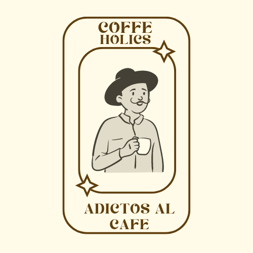

 

   Coffeeholics </h3>

## About The Project

  Coffeeholics es una ecommerce inspirada en el rubro cafeterías.
Tiene una sección estática, donde uno puede ver diferentes temas de interés del comercio y una pagina dedicada al shop y al formulario de contacto.

(<a href="#readme-top">back to top</a>)

## Built With

* ![React][React.js]
* ![Bootstrap][Bootstrap.com]
* [GitHub Pages](https://pages.github.com)
* [Font Awesome](https://fontawesome.com)
* [React Icons](https://react-icons.github.io/react-icons/search)

(<a href="#readme-top">back to top</a>)

## Contact

![LinkedIn][linkedin-shield] -  wuthrich09@gmail.com

Project Link: [https://github.com/WFederico97/coffeeholics](https://github.com/WFederico97/coffeeholics)

(<a href="#readme-top">back to top</a>)

[React.js]: https://img.shields.io/badge/React-20232A?style=for-the-badge&logo=react&logoColor=61DAFB
[Bootstrap.com]: https://img.shields.io/badge/Bootstrap-563D7C?style=for-the-badge&logo=bootstrap&logoColor=white
[linkedin-shield]: https://img.shields.io/badge/-LinkedIn-black.svg?style=for-the-badge&logo=linkedin&colorB=555
